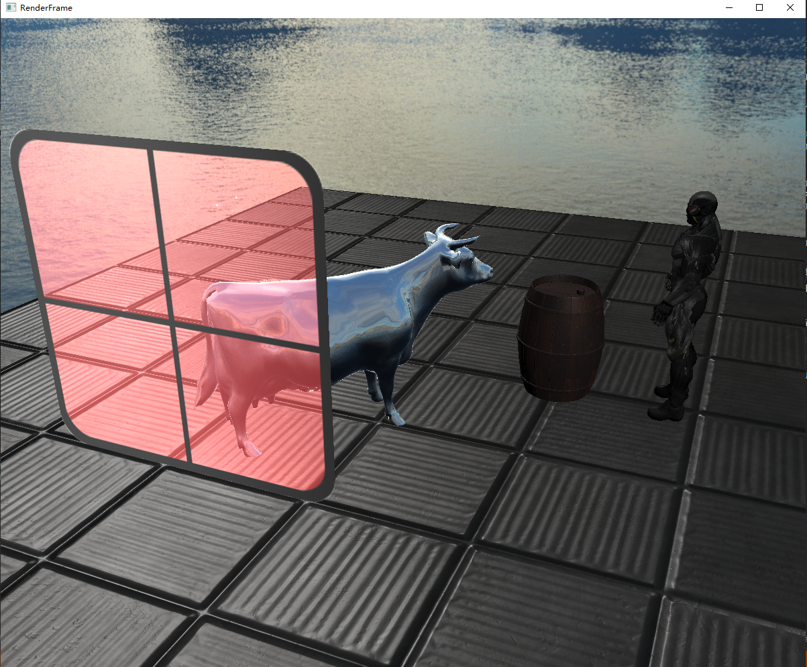

# 渲染框架

## 已有内容
- 组件(Component)
  - 变换(Transform)
  - 相机(Camera)
  - 网格引用(MeshReference)
  - 网格渲染(MeshRender)
  - 光源(LightComponent)
    - 点光源(PointLight)
    - 平行光(DirectLight)
- 对象
  - 物体(Object)
  - 纹理(Texture)
  - 网格(Mesh)
  - 模型(Model)
  - 材质(Material)
    - 默认镜面反射(DefaultSpecular)
    - 默认漫发射(DefaultDiffuse)
    - Phong光照模型(Phong)
    - 天空盒(SkyBox)
    - 环境映射(EnvironmentMapping)
    - BRDF材质(BRDF)
- 其他功能
  - 模型创建
  - 透明物体
  - 屏幕渲染(后期处理)
  - 场景漫游
## 示例

